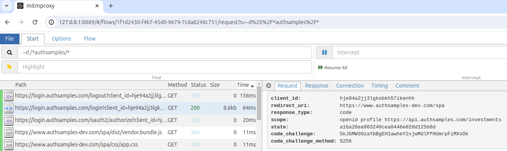

# OAuth HTTP Proxy

Utility scripts for a fast setup that enables capturing and visualization of OAuth related requests.\
The [mitmproxy](https://docs.mitmproxy.org/stable/) tool does the main work and this repo just provides helper scripts.

## Usage

The scripts enable me to capture HTTP(S) requests in a productive manner, without needing to think.\
They are self-documenting and work on Linux, Windows and macOS.\
Run mitmweb like this, which manages installation if needed:

```bash
./start.sh
```

Then capture OAuth requests, filtering on the domains you want to see traffic for:



When you are finished testing, run the following script in another terminal window:

```bash
./stop.sh
```

## Activating Backend Processes to use the HTTP Proxy

You may need to actively use the HTTP Proxy in some backend components.\
See the [HTTP Proxy Setup](https://apisandclients.com/posts/http-debugging-setup) blog post for further details.

## Configuring SSL Trust

You may need to do extra SSL trust configuration for some browsers and technology stacks.\
See the [Development SSL Setup](https://apisandclients.com/posts/developer-ssl-setup) blog post for further details.
