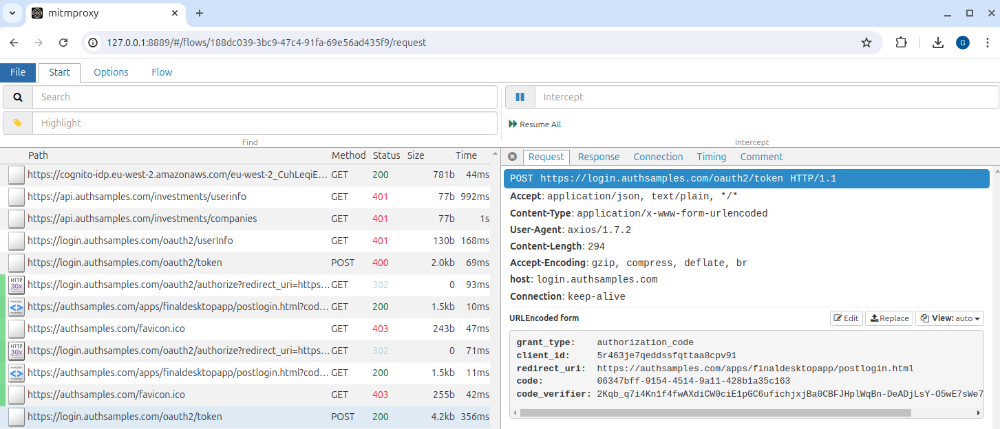

# OAuth HTTP Proxy

Utility scripts to consolidate my [mitmproxy](https://docs.mitmproxy.org/stable/) usage across platforms in a single place.\
I use mitmproxy on Linux, Windows (with Git bash) and macOS to visualize OAuth-related messages.

## Usage

Run mitmproxy like this, which manages download, certificate installation and proxy activation.\
The *mitmweb* user interface then visualizes HTTP requests and responses.

```bash
./start.sh
```

Then capture OAuth requests, and use the proxy's view filtering to limit hosts you see traffic for:



When you finish testing, run the following script to free resources:

```bash
./stop.sh
```

## Activating Backend Processes to use the HTTP Proxy

Some extra steps may be needed to capture messages in particular browsers and technology stacks.\
See the [HTTP Proxy Setup](https://github.com/gary-archer/oauth.blog/tree/master/public/posts/http-debugging-setup.mdx) blog post for further details.

## Configuring SSL Trust

You may need to do extra SSL trust configuration for particular browsers and technology stacks.\
See the [Development SSL Setup](https://github.com/gary-archer/oauth.blog/tree/master/public/posts/developer-ssl-setup.mdx) blog post for further details.
